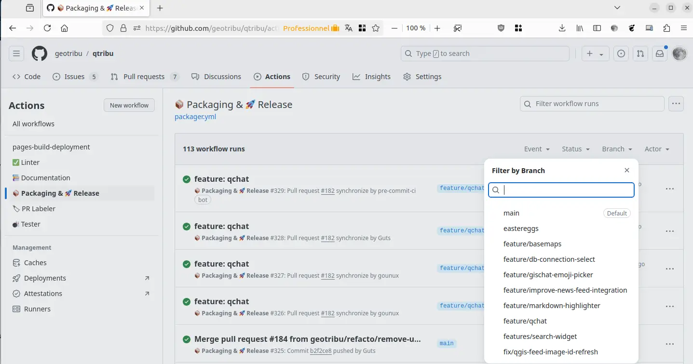
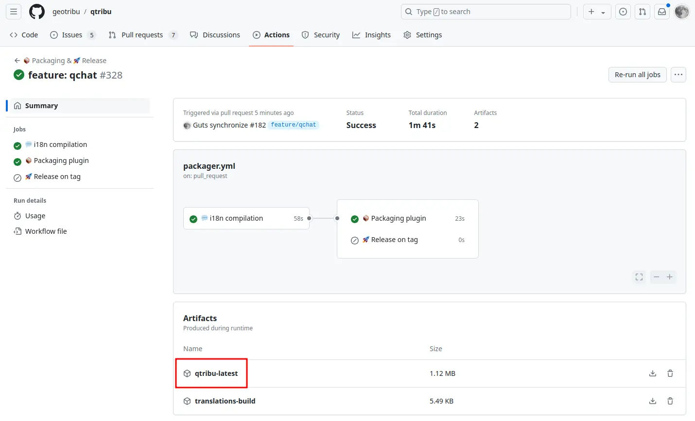
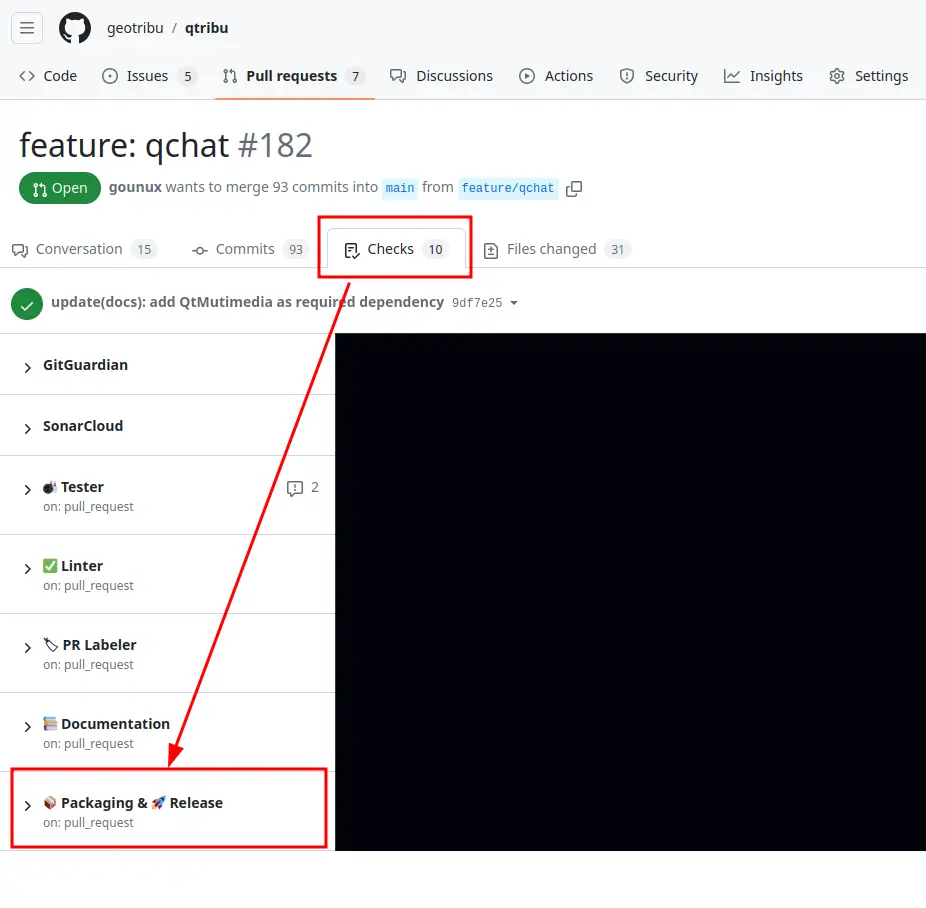

# Installation

## Dépendances

Certaines fonctionnalités du plugin reposent sur des dépendances logicielles tierces non incluses dans le packaging de QGIS sur certaines plateformes :

- QGISChat: (Py)QtMutimedia, (Py)QtWebEngine, (Py)QtWebSockets,

### Linux

> Par exemple sur Ubuntu 22.04. Adapter à votre distribution.

Ouvrir un terminal et exécuter la commande suivante :

```sh
sudo apt install python3-pyqt5.qtmultimedia python3-pyqt5.qtwebengine python3-pyqt5.qtwebsockets
```

----

## Version stable (recommandée)

Le plugin est publié sur le dépôt officiel des extensions de QGIS : <https://plugins.qgis.org/plugins/qtribu/>.

## Version stable depuis le projet Github (alternative)

En plus d'être publié dans le dépôt officiel de plugins de QGIS, QTribu est également disponible via son propre dépôt personnalisé. Dans QGIS :

1. Menu `Extensions` > `Installer/Gérer des extensions`
2. Onglet `Paramètres`
3. Sous la liste des dépôts, cliquer sur `Ajouter...` et renseigner :
    - Nom :

        ```txt
        Dépôt personnalisé du plugin QTribu
        ```

    - URL :  

    ```html
    https://github.com/geotribu/qtribu/releases/latest/download/plugins.xml
    ```

    

4. Une fois le dépôt ajouté, l'extension devrait apparaître dans l'onglet `Non installées`. Cliquer sur `Installer` :

    

:::{warning}
Selon votre configuration, redémarrer QGIS peut être nécessaire, le gestionnaire d'extensions ayant des comportements parfois capricieux par rapport aux dépôts tiers.
:::

----

## Version en développement

### Depuis une branche

1. S'identifier sur Github.com
1. Se rendre sur la page correspondant au workflow GitHub Actions "📦 Packaging & 🚀 Release" : [cliquer ici](https://github.com/geotribu/qtribu/actions/workflows/packager.yml)
1. Filtrer sur la branche souhaitée

    

1. Sélectionner la dernière exécution qui a fonctionné (avec une coche verte)
1. En bas de la page _Summary_, télécharger l'artefact du plugin packagé :

    

1. Décompresser le fichier ZIP.
1. Ajouter le zip depuis le menu de QGIS ([voir la doc officielle](https://docs.qgis.org/3.34/fr/docs/user_manual/plugins/plugins.html#the-install-from-zip-tab) pour cette étape si besoin)

:::{note}
Il est aussi possible d'accéder à la page depuis l'onglet `Checks` de la Pull Request correspondante :


:::

----

## Intégration dans QGIS

Une fois installé, le plugin s'intègre :

- dans le menu `Internet` :


- dans la barre d'outils :


