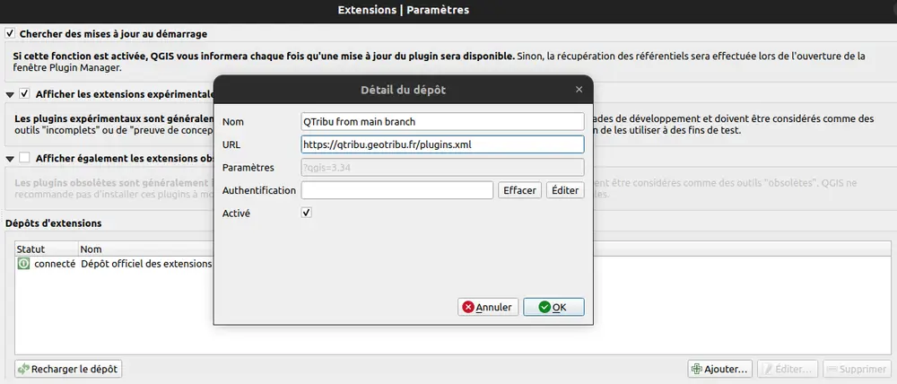
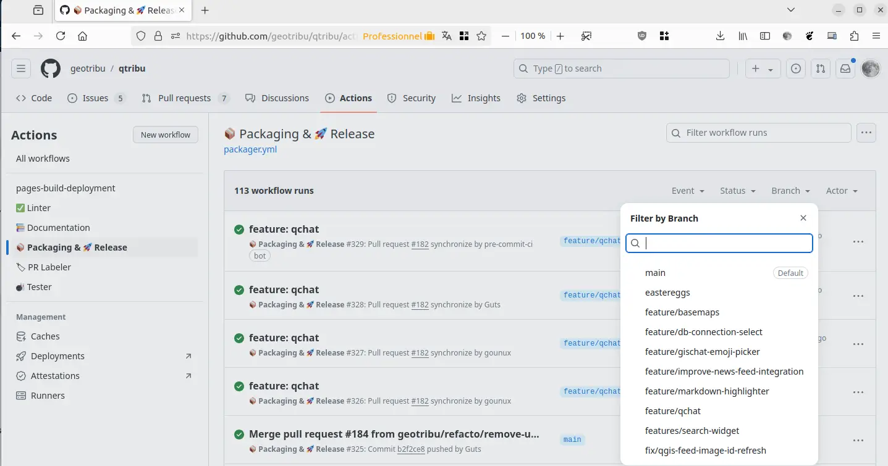
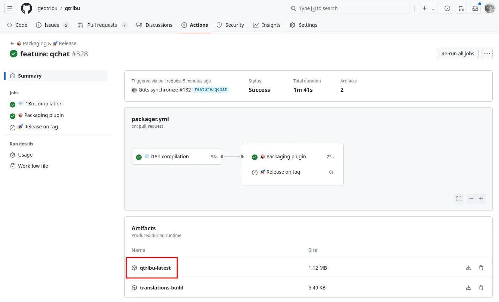
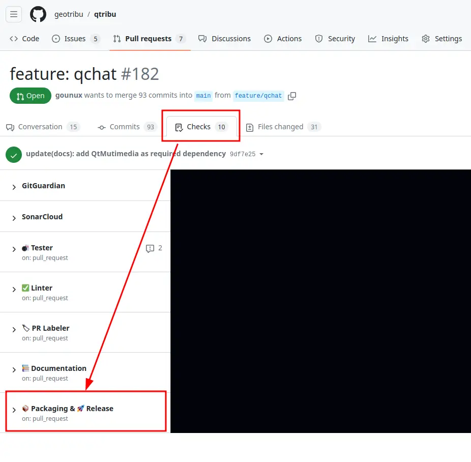

# Installation

## Dépendances

Certaines fonctionnalités du plugin reposent sur des dépendances logicielles tierces non incluses dans le packaging de QGIS sur certaines plateformes :

- Navigateur web intégré : (Py)QtWebEngine

### Linux

> Par exemple sur Ubuntu 24.04. Adapter à votre distribution.

- Avec QGIS 3 (Qt 5), ouvrir un terminal et exécuter la commande suivante :

    ```sh
    sudo apt install python3-pyqt5.qtwebengine
    ```

- Avec QGIS 4 (Qt 6), ouvrir un terminal et exécuter la commande suivante :

    ```sh
    sudo apt install python3-pyqt6.qtwebengine
    ```

### Windows et macOS

Les installeurs de QGIS 3 (Qt 5) incluent déjà les dépendances nécessaires pour le navigateur web intégré.

En revanche, les installeurs de QGIS 4 (Qt 6) ne les incluent pas à date de la 4.0.1. En effet, le paquet `python3-pyqtwebengine` disponible dans l'OSGEo4W est toujours celui basé sur PyQt5 (voir [le sujet sur le plugin qgis2threjs](https://github.com/minorua/Qgis2threejs/wiki/How-to-use-Qt-WebEngine-view-with-Qgis2threejs)). Le navigateur système est utilisé par défaut de façon transparente.

----

## Version stable (recommandée)

Le plugin est publié sur le dépôt officiel des extensions de QGIS : <https://plugins.qgis.org/plugins/qtribu/>.

## Version stable depuis le projet Github (alternative)

En plus d'être publié dans le dépôt officiel de plugins de QGIS, QTribu est également disponible via son propre dépôt personnalisé. Dans QGIS :

1. Menu `Extensions` > `Installer/Gérer des extensions`
2. Onglet `Paramètres`
3. Sous la liste des dépôts, cliquer sur `Ajouter...` et renseigner :
    - Nom :

        ```txt
        Dépôt personnalisé du plugin QTribu
        ```

    - URL :  

    ```html
    https://github.com/geotribu/qtribu/releases/latest/download/plugins.xml
    ```

    

4. Une fois le dépôt ajouté, l'extension devrait apparaître dans l'onglet `Non installées`. Cliquer sur `Installer` :

    

:::{warning}
Selon votre configuration, redémarrer QGIS peut être nécessaire, le gestionnaire d'extensions ayant des comportements parfois capricieux par rapport aux dépôts tiers.
:::

----

## Version en développement

### Depuis Version en développement

Si vous vous considérez comme un *early adopter*, un testeur ou que vous ne pouvez attendre qu'une version soit publiée (même dans le canal expérimental du dépôt officiel de QGIS !), vous pouvez utiliser la version automatiquement packagée pour chaque commit poussé sur la branche principale.

Pour cela, il faut ajouter cette URL dans [les dépôts référencés du gestionnaire d'extensions de QGIS](https://docs.qgis.org/3.34/fr/docs/user_manual/plugins/plugins.html#the-settings-tab) :

```html
https://qtribu.geotribu.fr/plugins.xml
```


Cliquer sur `+ Add` et entrer l'URL :



### Depuis une branche

1. S'identifier sur Github.com
1. Se rendre sur la page correspondant au workflow GitHub Actions "📦 Packaging & 🚀 Release" : [cliquer ici](https://github.com/geotribu/qtribu/actions/workflows/packager.yml)
1. Filtrer sur la branche souhaitée

    

1. Sélectionner la dernière exécution qui a fonctionné (avec une coche verte)
1. En bas de la page *Summary*, télécharger l'artefact du plugin packagé :

    

1. Décompresser le fichier ZIP.
1. Ajouter le zip depuis le menu de QGIS ([voir la doc officielle](https://docs.qgis.org/3.34/fr/docs/user_manual/plugins/plugins.html#the-install-from-zip-tab) pour cette étape si besoin)

:::{note}
Il est aussi possible d'accéder à la page depuis l'onglet `Checks` de la Pull Request correspondante :


:::

----

## Intégration dans QGIS

Une fois installé, le plugin s'intègre :

- dans le menu `Internet` :


- dans la barre d'outils :


